# Modello dati

Fonte: PRD-ORCHESTRATOR-V2.md §5 (Modello dati), §0.3 (glossario e mappa dei nomi). Schema
verificato contro le migrazioni reali in `database/migrations/`. Questo documento descrive lo schema
**come è oggi**, comprese le aggiunte della Fase 6 (`tickets.archived_at`, colonne MFA su `users`).

## Principi dello schema (§5.1)

1. Tabelle al plurale, snake_case, inglese. Pivot con i due nomi al singolare in ordine alfabetico
   (`ticket_tag`) tranne dove un nome descrittivo è più chiaro (`fundraising_project_partners`).
2. Enum come `varchar` + backed enum PHP, valori in lowercase slug — mai un tipo `ENUM` nativo
   Postgres.
3. `created_at`/`updated_at` ovunque; `deleted_at` (soft delete) solo su `tickets`, `users`, `tags`,
   `documentation_pages`.
4. Vincoli espliciti: FK con `ON DELETE` dichiarato caso per caso, unique dove esiste unicità
   logica, `NOT NULL` come default mentale.
5. Nessun dato derivato senza rigenerazione: `tickets.worked_minutes`, i totali di valutazione
   fundraising, ecc. sono sempre ricostruibili da un comando (`timetracking:recalculate`,
   `timetracking:aggregate-daily`, stage `derive` dell'ETL).
6. Continuità degli identificativi: `users.id`, `tickets.id`, `tags.id`, `documentation_pages.id`,
   `organizations.id`, `activity_reports.id` e le entità fundraising conservano l'id del v1.

## Diagramma ER

```mermaid
erDiagram
    users ||--o{ organization_user : "appartiene a"
    organizations ||--o{ organization_user : "ha membri"

    users ||--o{ tickets : "richiede (requester_id)"
    users ||--o{ tickets : "è assegnatario (assignee_id)"
    users ||--o{ tickets : "è tester (tester_id)"
    tickets ||--o| tickets : "parent_id (profondità max 1)"
    tickets ||--o{ ticket_messages : ha
    tickets ||--o{ ticket_logs : ha
    tickets ||--o{ ticket_views : ha
    tickets ||--o{ ticket_participants : ha
    tickets ||--o{ ticket_tag : ha
    tickets ||--o{ ticket_work_logs : ha
    tickets }o--o| fundraising_projects : "collegato a"
    tags ||--o{ ticket_tag : ha
    tags }o--o| documentation_pages : "documenta (documentation_id)"
    ticket_messages }o--o| email_messages : "origine (email_message_id)"
    users ||--o{ ticket_messages : "autore (author_id, nullable)"

    users ||--o{ activity_reports : "owner (owner_user_id)"
    organizations ||--o{ activity_reports : "owner (owner_organization_id)"
    activity_reports ||--o{ activity_report_ticket : ha
    tickets ||--o{ activity_report_ticket : ha

    fundraising_opportunities ||--o{ fundraising_evaluation_scores : ha
    fundraising_opportunities ||--o{ fundraising_projects : genera
    fundraising_projects ||--o{ fundraising_project_partners : ha
    users ||--o{ fundraising_project_partners : "è partner"

    email_threads ||--o{ email_messages : raggruppa
    email_messages ||--o{ email_attachments : ha
    tickets ||--o{ email_messages : "collegata a"
    users ||--o{ email_messages : "mittente/destinatario riconosciuto"
    users ||--o{ notification_preferences : ha
    users ||--o{ email_suppressions : "(per indirizzo, non FK)"

    users }o--o{ roles : "ha (Spatie)"
    roles }o--o{ permissions : "comporta (Spatie)"
    users }o--o{ permissions : "diretti (Spatie)"
```

Il diagramma omette, per leggibilità, le tabelle di infrastruttura standard (`media`, `jobs`,
`job_batches`, `failed_jobs`, `personal_access_tokens`, `cache`, `sessions`,
`password_reset_tokens`, `notifications`) e quelle dell'ETL (`import_runs`, `import_mappings`, non
in relazione applicativa con lo schema di dominio).

## Tabelle per area

### Identità

| Tabella | Contenuto | Note |
|---|---|---|
| `users` | Anagrafica, `email` (unique, indice funzionale `lower(email)`), `locale`, `drive_url`/`drive_budget_url`, `deactivated_at` (§6.7.5), `app_authentication_secret`/`app_authentication_recovery_codes` (MFA, `encrypted`/`encrypted:array`, aggiunte Fase 6 US-606) | `password` nullable: utenti importati dall'ETL che non hanno mai fatto login |
| `organizations` | `name`, `locale` | id conservato dal v1 |
| `organization_user` | pivot `organization_id`/`user_id` | unique sulla coppia |
| `roles`, `permissions`, `model_has_roles`, `model_has_permissions`, `role_has_permissions` | tabelle standard `spatie/laravel-permission` | guard unico `web`, `teams` disabilitato — vedi `docs/authorization.md` |

### Ticketing

| Tabella | Contenuto | Note |
|---|---|---|
| `tickets` | `parent_id`, `title`, `description` (interna), `status`/`previous_status`/`status_changed_at`, `type`, `priority`, `requester_id`/`assignee_id`/`tester_id`, `fundraising_project_id`, `waiting_reason`/`problem_reason`, `estimated_hours`, `worked_minutes` (derivato), `staging_url`/`production_url`, `released_at`/`done_at`, `archived_at` (Fase 6, US-611) | id conservato dal v1; `deleted_at` soft-delete |
| `ticket_messages` | conversazione strutturata: `ulid` (token di reply), `author_id`/`author_email`, `channel` (web/email/system), `visibility` (public/internal — solo `public` esposta in UI in questa release), `body_html`/`body_text`, `email_message_id`, `is_legacy_import` | sostituisce `stories.customer_request` (HTML accumulato del v1) |
| `ticket_logs` | eventi di dominio: `event`, `from_status`/`to_status` (colonne, non JSON), `changes` (jsonb, solo diff/marker), `is_system` | sostituisce (in parte) `story_logs` |
| `ticket_views` | tracciamento visualizzazioni, separato dai log: `viewed_on`, `last_viewed_at`, `view_count` | unique `(ticket_id, user_id, viewed_on)` |
| `ticket_participants` | pivot `ticket_id`/`user_id` | |
| `ticket_tag` | pivot `ticket_id`/`tag_id` | |
| `ticket_work_logs` | aggregato giornaliero derivato: `work_date`, `user_id`, `ticket_id`, `minutes` | sostituisce `users_stories_log` |

### Tag / commesse e documentazione

| Tabella | Contenuto |
|---|---|
| `tags` | `name`, `slug`, `estimated_hours`, `documentation_id` (unico collegamento superstite del morph polimorfico v1) |
| `documentation_pages` | `title`, `slug`, `body`, `category` (`internal`/`customer`), `pdf_path`/`pdf_generated_at` |

### Rendicontazione

| Tabella | Contenuto |
|---|---|
| `activity_reports` | `owner_kind` (`user`/`organization`) + `owner_user_id`/`owner_organization_id` (CHECK: esattamente uno valorizzato, coerente con `owner_kind`), `period_type`/`year`/`month`, `locale`, `pdf_path`/`pdf_generated_at` |
| `activity_report_ticket` | pivot |

### Fundraising

| Tabella | Contenuto |
|---|---|
| `fundraising_opportunities` | anagrafica bando, `territorial_scope`, `created_by`/`responsible_user_id`/`evaluated_by`/`evaluated_at`, totali di valutazione (derivati) |
| `fundraising_evaluation_scores` | le 34 colonne `evaluation_*` del v1 normalizzate in righe (`criterion_key`, `score`, `notes`) |
| `fundraising_projects` | progetto generato da un'opportunità, `status` (`FundraisingProjectStatus`) |
| `fundraising_project_partners` | pivot progetto↔utente |

### Email

| Tabella | Contenuto |
|---|---|
| `email_messages` | registro unico inbound+outbound: `direction`, `message_id`/`in_reply_to`/`references`, `thread_id`, `ticket_id`, `user_id`, `to`/`cc`/`bcc` (jsonb, array di stringhe email), `status`, `mailable_class`, `content_hash` (dedup), `imap_uid`/`imap_folder` |
| `email_threads` | `subject_normalized`, `participants` (jsonb) — alimenta il matching euristico |
| `email_attachments` | allegati email, `status` (`stored`/`rejected_mime`/`rejected_size`/`failed`) |
| `email_suppressions` | soppressioni per indirizzo: `reason` (`hard_bounce`/`soft_bounce`/`complaint`/`manual`/`loop_protection`), `bounce_count`, `expires_at` |
| `notification_preferences` | `user_id`/`notification_type`/`channel`/`enabled`, unique sulla terna |
| `email_message_logs` | audit trail delle azioni amministrative sulle email (Fase 3, US-322) |

### Importazione e infrastruttura

| Tabella | Contenuto |
|---|---|
| `import_runs` | audit dell'ETL: stage eseguiti, conteggi, esito |
| `import_mappings` | corrispondenza v1→v2 per le entità senza id conservato |
| `notifications` | tabella standard Laravel per le notifiche in-app Filament — colonna `data` è `json` (migrazione `2026_08_26_120000_change_notifications_data_column_to_json.php`, corregge un bug scoperto in Fase 3, vedi `docs/differences-from-v1.md`) |

## Mappa dei nomi v1 → v2 (§0.3)

| v1 (Nova) | v2 | Note |
|---|---|---|
| `stories` / "Story" | `tickets` / "Ticket" | l'interfaccia v1 già li chiamava Ticket |
| `stories.name` | `tickets.title` | |
| `stories.user_id` | `tickets.assignee_id` | il developer assegnato |
| `stories.creator_id` | `tickets.requester_id` | chi ha aperto la richiesta |
| `stories.customer_request` | tabella `ticket_messages` | la conversazione diventa strutturata |
| `stories.hours` | `tickets.worked_minutes` | interi, non float |
| `stories.test_dev` / `test_prod` | `tickets.staging_url` / `production_url` | |
| `story_logs` | `ticket_logs` + `ticket_views` | separati: eventi di dominio vs visualizzazioni |
| `users_stories_log` | `ticket_work_logs` | aggregato giornaliero derivato |
| `story_story` | *eliminata* | la gerarchia vive solo in `tickets.parent_id` |
| `taggables` (parte ticket) | `ticket_tag` | pivot esplicito |
| `tags.taggable_*` | `tags.documentation_id` | il morph polimorfico sparisce |
| `documentations` | `documentation_pages` | |
| `users.roles` (JSON su varchar) | tabelle `spatie/laravel-permission` | ruoli e permessi normalizzati |
| `users.activity_report_language` | `users.locale` | lingua di **tutte** le comunicazioni |
| `activity_reports.customer_id` | `activity_reports.owner_user_id` | il v1 puntava a `users` con un nome fuorviante |
| 34 colonne `evaluation_*` | `fundraising_evaluation_scores` | normalizzate in righe |
| `customers`, `quotes`, `products`, `epics`, `milestones`, `projects`, `deadlines`, `apps`, `layers` | *non importate* | fuori scope (§3.2) |

Altri termini: **Tag/commessa** — nel v1 il Tag ha assunto il ruolo di commessa (stima ore + SAL
calcolato), non è una semplice etichetta. **v1** = il codice Nova in produzione. **v2** = questo
sistema. **ETL** = la procedura di importazione (`docs/import-v1.md`).

## Enum principali

Tutti backed enum PHP con `label()` localizzata; quelli con semantica di stato implementano anche
`HasColor`/`HasIcon` (interfacce Filament).

| Enum | Percorso | Valori |
|---|---|---|
| `TicketStatus` | `App\Domain\Ticketing\Enums\TicketStatus` | `new`, `backlog`, `assigned`, `todo`, `progress`, `testing`, `tested`, `released`, `done`, `problem`, `waiting`, `rejected` — valori identici al v1 |
| `TicketType` | `App\Domain\Ticketing\Enums\TicketType` | `bug`, `feature`, `helpdesk`, `scrum` |
| `TicketPriority` | `App\Domain\Ticketing\Enums\TicketPriority` | `low`, `medium`, `high` |
| `UserRole` | `App\Domain\Identity\Enums\UserRole` | `admin`, `developer`, `manager`, `customer`, `fundraising` (`editor` eliminato, D14) |
| `Permission` | `App\Domain\Identity\Enums\Permission` | catalogo completo in `docs/authorization.md` |
| `DocumentationCategory` | `App\Domain\Documentation\Enums\DocumentationCategory` | `internal`, `customer` |
| `TicketMessageChannel` | `App\Domain\Ticketing\Enums\TicketMessageChannel` | `web`, `email`, `system` |
| `TicketMessageVisibility` | `App\Domain\Ticketing\Enums\TicketMessageVisibility` | `public`, `internal` |
| `TicketLogEvent` | `App\Domain\Ticketing\Enums\TicketLogEvent` | `created`, `status_changed`, `assigned`, `updated`, `message_posted`, `attachment_added`, `attachment_removed`, `system`, `archived` (Fase 6, US-611) |
| `NotificationType` | `App\Domain\Mail\Enums\NotificationType` | un case per comunicazione E1-E11 effettivamente implementata — vedi `docs/email.md` |

Enum del v1 non portati: `EpicStatus`, `QuoteStatus`, `DeadlineStatus`.

## Note aggiuntive Fase 6

- `tickets.archived_at` (migrazione `2026_08_28_110000_add_archived_at_to_tickets_table.php`):
  colonna additiva per `tickets:archive-scrum` (US-611) — mai una cancellazione né un cambio di
  `status`, sempre accompagnata da un `ticket_log` (`event = archived`, `is_system = true`).
- `users.app_authentication_secret`/`app_authentication_recovery_codes` (migrazione
  `2026_08_28_100000_add_app_authentication_columns_to_users_table.php`): supporto MFA nativa
  Filament (US-606), sempre cifrate a riposo.
- `notifications.data` è stato cambiato da `text` a `json` in
  `2026_08_26_120000_change_notifications_data_column_to_json.php`: correzione di un bug reale
  scoperto in Fase 3 (query Filament con l'operatore `->>'format'` su una colonna dichiarata
  `text`), vedi `docs/differences-from-v1.md`.
