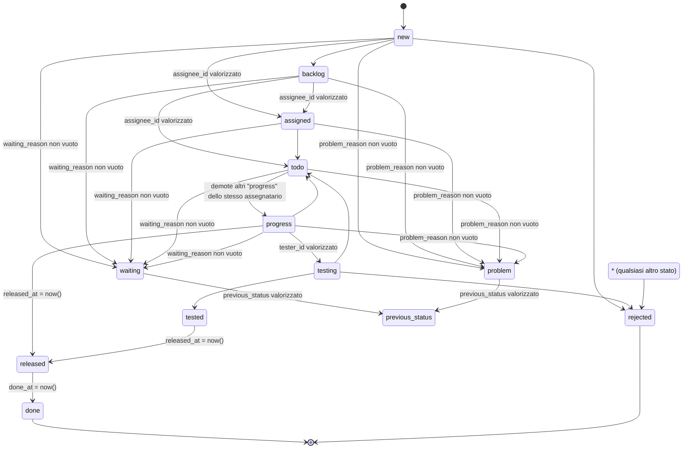

# Ciclo di vita del ticket

Fonte: PRD-ORCHESTRATOR-V2.md §6.1 (Ticketing), §6.1.3 (macchina a stati), §6.1.4 (un solo
`progress` per assegnatario), §6.1.5 (transizioni automatiche), §6.1.6 (gerarchia padre/figlio),
§6.1.7 (conversazione), §9.5 (regole sul record), §14 (criteri di accettazione Fase 1). Implementato
nelle story US-101...US-113 (Fase 1). Questo documento descrive **cosa è vero nel codice oggi**, non
un piano: dove qualcosa è rimandato a una fase successiva è annotato esplicitamente.

## Diagramma degli stati

Solo le transizioni "manuali" attive in Fase 1 (§6.1.3). Le transizioni riservate a comandi
schedulati non ancora esistenti sono descritte a parte, in [Transizioni automatiche](#transizioni-automatiche-616).

**Percorso principale**: `new → assigned → todo → progress → testing → tested → released → done`.

**Percorso senza testing**: `new → assigned → todo → progress → released → done`.

`waiting`/`problem → previous_status` non è una singola freccia verso uno stato fisso: `to` è
risolto a runtime confrontando il target richiesto con la colonna `tickets.previous_status` del
ticket, non con righe di tabella duplicate per ogni possibile stato precedente. Nel diagramma è
rappresentato come un unico nodo simbolico `previous_status`.

## Tabella dichiarativa delle transizioni

Fonte di verità: `App\Domain\Ticketing\StateMachine\TicketStateMachine::transitions()`. Nessun `if`
sparso altrove (principio A2 del PRD) — per aggiungere/modificare una transizione si tocca solo
quell'array.

| Da | A | Chi (`TransitionActor`) | Guard | Effetti (`TransitionEffect`) |
|---|---|---|---|---|
| `new` | `assigned` | AdminOrManager, AutoAssigningDeveloper | `assignee_id` valorizzato | — |
| `new` | `backlog` | AdminOrManager, NoRelationRequired | — | — |
| `new` | `rejected` | AdminOrManager | — | — |
| `backlog` | `assigned` | AdminOrManager, AutoAssigningDeveloper | `assignee_id` valorizzato | — |
| `backlog` | `todo` | AdminOrManager, AutoAssigningDeveloper | `assignee_id` valorizzato | — |
| `assigned` | `todo` | AdminOrManager, Assignee, **System** | — | — |
| `todo` | `progress` | AdminOrManager, Assignee | — | `DemoteOtherProgressTickets` (§6.1.4) |
| `progress` | `testing` | AdminOrManager, Assignee | `tester_id` valorizzato | — |
| `progress` | `released` | AdminOrManager, Assignee | — | `SetReleasedAt` |
| `progress` | `todo` | AdminOrManager, Assignee, **System** | — | — |
| `testing` | `tested` | AdminOrManager, Tester | — | — |
| `testing` | `todo` | AdminOrManager, Tester | — | — |
| `testing` | `rejected` | AdminOrManager, Tester | — | — |
| `tested` | `released` | AdminOrManager, Assignee | — | `SetReleasedAt` |
| `released` | `done` | AdminOrManager, Assignee | — | `SetDoneAt` |
| `new`, `backlog`, `assigned`, `todo`, `progress` | `waiting` | AdminOrManager, Assignee | `waiting_reason` non vuoto | `SavePreviousStatus` |
| `new`, `backlog`, `assigned`, `todo`, `progress` | `problem` | AdminOrManager, Assignee | `problem_reason` non vuoto | `SavePreviousStatus` |
| `waiting` | *(risolto: `previous_status`)* | AdminOrManager, Assignee, **System** | `previous_status` valorizzato | `RestorePreviousStatus` |
| `problem` | *(risolto: `previous_status`)* | AdminOrManager, Assignee | `previous_status` valorizzato | `RestorePreviousStatus` |
| *qualsiasi altro stato non coperto sopra* | `rejected` | AdminOrManager | — | — |

Note:

- **DECISIONE Q4**: nessuna riga per T2 (azzeramento di `assignee_id` su un cambio di stato manuale
  di un ticket `new`) — comportamento esplicitamente diverso dal v1. Un cambio di stato manuale su
  un ticket `new` non tocca mai `assignee_id`.
- Per le transizioni da `new`/`backlog` che richiedono `assignee_id` valorizzato, un developer
  (`AutoAssigningDeveloper`) è un attore ammesso **solo** se il contesto passato alla transizione
  assegna il ticket a sé stesso (`context['assignee_id'] === auth()->id`), mai a un altro utente —
  verificato sia lato Filament (US-110) sia direttamente contro la macchina a stati (US-114), a
  prova di un ipotetico punto di ingresso futuro che aggirasse la UI.
- L'attore **System** compare solo su `assigned → todo`, `progress → todo` e
  `waiting → previous_status`: righe già pronte per i comandi schedulati di Fase 6 (T3, T6), anche
  se quei comandi non esistono ancora in questa fase.

## Validazioni di dominio (US-102)

Regole `Illuminate\Contracts\Validation\ValidationRule` in `App\Domain\Ticketing\Rules`, riusate sia
dai guard della macchina a stati sia da qualunque punto di ingresso futuro (form Filament, API):

| Regola | Condizione | Messaggio (italiano) |
|---|---|---|
| `TicketTesterRequiredRule` | transizione verso `testing` | `tester_id` deve essere valorizzato |
| `TicketWaitingReasonRequiredRule` | transizione verso `waiting` | `waiting_reason` non può essere vuoto |
| `TicketProblemReasonRequiredRule` | transizione verso `problem` | `problem_reason` non può essere vuoto |
| `TicketParentDepthRule` | assegnazione di `parent_id` | un ticket con figli non può a sua volta avere un padre (profondità massima 1, §6.1.6) |

Una transizione non presente in tabella, o il cui guard/regola fallisce, produce sempre un
`Illuminate\Validation\ValidationException` con messaggio leggibile — mai un'eccezione generica
(A2 del PRD).

## Regola "un solo `progress` per assegnatario" (§6.1.4)

Effetto `DemoteOtherProgressTickets` sulla transizione `todo → progress`: nella stessa transazione
di `ChangeTicketStatus`, tutti gli altri ticket dello stesso `assignee_id` già in `progress` passano
a `todo`, ciascuno con il proprio `ticket_log` indipendente (`from_status = progress`,
`to_status = todo`). Se la demozione fallisce, l'intero cambio di stato (incluso quello del ticket
che ha innescato la demozione) va in rollback.

## Ripristino da `waiting`/`problem`

`previous_status` è una colonna (non ricostruita a posteriori dai log come nel v1): impostata da
`SavePreviousStatus` all'ingresso in `waiting`/`problem`, azzerata da `RestorePreviousStatus` al
ripristino. Due percorsi di ripristino attivi in Fase 1:

1. **Esplicito**: un admin/manager/assegnatario invoca la transizione di ripristino da UI o Action.
2. **Regola T7** (§6.1.5, decisione Q14, `App\Domain\Ticketing\Listeners\RestoreTicketStatusOnRequesterMessage`):
   quando il **richiedente** posta un messaggio, se lo stato corrente è `waiting` il ticket torna a
   `previous_status`; altrimenti, se lo stato è `assigned`/`progress` (attesa implicita di risposta
   del cliente), passa a `todo`. Sempre via `ChangeTicketStatus`, mai una scrittura diretta di
   `status`, attribuito all'utente di sistema.

Il ripristino schedulato (T6, ticket `waiting` da troppi giorni) resta rimandato a Fase 6 (vedi
sotto): la riga di tabella che lo renderà possibile (attore `System` su `waiting → previous_status`)
esiste già.

## Transizioni automatiche (§6.1.5)

| # | Quando | Cosa | Stato in Fase 1 |
|---|---|---|---|
| T1 | Assegnazione di un assegnatario a un ticket `new` | `new → assigned` | **Attivo**: effetto dell'Action `AssignTicket`/`ChangeTicketStatus`, non un hook Eloquent |
| T2 | Cambio di stato manuale di un ticket `new` | azzeramento di `assignee_id` | **Escluso per decisione Q4**: comportamento del v1 esplicitamente non riprodotto |
| T3 | Ogni giorno alle 18:00 | tutti i ticket `progress → todo` | **Rimandato a Fase 6** (comando `tickets:progress-to-todo` non ancora esistente). Nessuna riga di tabella dedicata: la userà lo stesso comando invocando la riga `progress → todo` già presente con attore System |
| T4 | Ogni giorno alle 07:45 | `released` da ≥ 3 giorni lavorativi `→ done` | **Rimandato a Fase 6** (comando `tickets:auto-close-released`) |
| T5 | Ogni giorno alle 16:00 | ticket `scrum` creati/aggiornati oggi `→ done` | **Rimandato a Fase 6** (comando `tickets:close-scrum` + riga dichiarata `* → done`, attore System, guard `type = scrum`: non presente in tabella oggi) |
| T6 | Ogni giorno | `waiting` da ≥ N giorni `→ previous_status` | **Rimandato a Fase 6** (comando `tickets:restore-waiting`); la riga `waiting → previous_status` con attore System esiste già (serve anche a T7) |
| T7 | Il richiedente posta un messaggio | `waiting → previous_status`, oppure `assigned`/`progress → todo` | **Attivo** (US-106), vedi sopra |

Tutte le transizioni automatiche, quando implementate, dovranno: scrivere un `ticket_log` con
`is_system = true`, essere attribuite all'utente di sistema (`App\Domain\Identity\Models\User::system()`),
essere idempotenti.

## Calcolo delle ore lavorate

Documentato in dettaglio nel codice di `App\Domain\TimeTracking\WorkedTimeCalculator` (US-109): deriva
`tickets.worked_minutes` e l'aggregato `ticket_work_logs` dagli intervalli tra un `ticket_log` con
`to_status = progress` e il successivo con `from_status = progress`, contando solo lunedì-venerdì
nella finestra oraria configurata (`config/timetracking.php`). **DECISIONE Q15**: una sola politica di
calcolo (non le due divergenti del v1) — i numeri storici confrontati col v1 potranno divergere per
questa scelta, da misurare nel report di importazione della Fase 2.

## Verifica end-to-end (US-114)

`tests/Feature/Domain/Ticketing/TicketLifecycleEndToEndTest.php` percorre l'intero ciclo di vita con
Action reali in sequenza (mai stato seminato direttamente nel DB): percorso principale, percorso
senza testing, demozione "un solo progress per assegnatario" durante un percorso reale, ripristino
da `waiting`/`problem` (esplicito e via regola T7), e due tentativi di bypass di una transizione non
ammessa (manipolazione dei dati di un'action Filament, e chiamata diretta a `ChangeTicketStatus` con
un contesto di auto-assegnazione impersonato) — entrambi bloccati.
